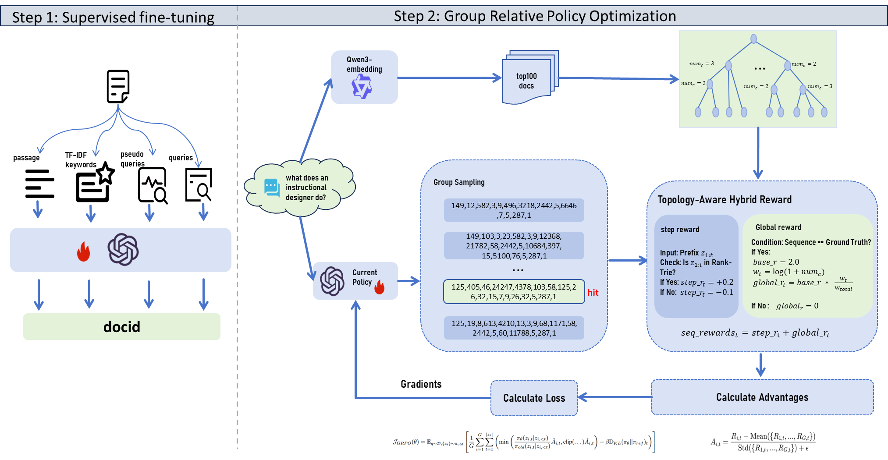

# 重点：不理解的就问我，问AI，搜B站等等 模糊不确定的地方都弄清楚，这个项目拿去面试就不会被问住了，老师可能很懂这个，也可能很不懂，问你问题不要慌，按照你的理解说出来即可，实在不知道的话就把话引到你知道的相关的点上，自信一点
## 看项目之前需要了解的知识：
    - 什么是稀疏检索 稠密检索 生成式检索？生成式检索的优势是什么？
    - 大模型，大模型（主要用到的大模型是T5模型）的词表，大模型的工作流程
## 这篇工作的主要架构涉及3个方面

1. docid的表示形式
    - docid的意思就是文档的id（相当于人的名字）
    
        为什么不能用随机数字？：解释 Atomic IDs 缺乏语义信息，难以泛化 。
        TU 策略（Title-URL）：具体是怎么实现的？
        如果网页的url语义丰富的话，使用反转清洗处理后的url当作docid；
        如果网页的url语义不丰富的话，则使用文档的标题+网页域名当作docid
    
2. 监督微调训练（也就是SFT，Supervised Fine-Tuning）
    - 了解几个微调的概念：（重点看一下全量微调，LoRA微调，提示词微调这三个）
    [大模型的参数高效微调（PEFT），LoRA微调以及其它.md](https://github.com/luhengshiwo/LLMForEverybody/blob/main/03-%E7%AC%AC%E4%B8%89%E7%AB%A0-%E5%BE%AE%E8%B0%83/%E5%A4%A7%E6%A8%A1%E5%9E%8B%E7%9A%84%E5%8F%82%E6%95%B0%E9%AB%98%E6%95%88%E5%BE%AE%E8%B0%83%EF%BC%88PEFT%EF%BC%89%EF%BC%8CLoRA%E5%BE%AE%E8%B0%83%E4%BB%A5%E5%8F%8A%E5%85%B6%E5%AE%83.md)
        - 全量微调(Full Fine-Tuning)： 
                    原理：更新模型中所有层的参数。
                    优点：理论上能达到模型表现的上限，因为所有参数都在针对新任务（如检索任务）进行调整 。
                    缺点：计算开销巨大。以 T5-Base (220M) 为例，虽然它在 A100 上跑得动，但如果是 7B 以上的模型，全量微调对显存的要求极高 。
        - 参数高效微调 (PEFT, Parameter-Efficient Fine-Tuning)：以下几种
            - LoRA (Low-Rank Adaptation)：
                原理：在原有的线性层旁边“外挂”两个低秩矩阵（A 和 B），只训练这两个矩阵，原模型参数冻结。
                特点：显存占用极低，且推理时可以将 A、B 矩阵合并回原参数，实现零推理延迟。
            - Prompt Tuning (提示词微调)：
                原理：在输入层添加一段可学习的“虚拟 Token”（Soft Prompts）。
                形象理解：模型参数不动，只优化“怎么向模型提问”的那一小段向量。
            - Prefix Tuning (前缀微调)：
                原理：在每一层 Transformer 的 Key 和 Value 矩阵前添加可训练的前缀。
                区别：相比 Prompt Tuning 只改输入层，Prefix Tuning 对每一层都有干预，控制力更强。
            - Adapter Tuning (适配器微调)：
            原理：在 Transformer 的层级结构中插入小的瓶颈层（Adapter）。
            特点：训练时只更新这些小插件。虽然有效，但会增加模型的层深度，导致推理速度稍微变慢。

    - 本项目是怎么微调的呢？
    在 SFT 阶段，我采用了 全量微调（Full Fine-Tuning） 策略。
    理由如下：
        1. 任务迁移强度大：模型需要从通用的 NLP 任务迁移到 DocID 生成任务，全量微调能让模型更好地改写参数以适应这种任务 。
        2. 参数规模可控：项目基座使用的是 T5-Base（约 220M 参数，也就是0.2B），模型参数较小。（问你使用的什么显卡的话，我用的是8张A100 80G显存，微调大概需要1天，问你哪来的卡的话，可以说本科老师跟企业合作，当时租的卡，或者改天我试试在3090上需要多久 估计得好几天）
        3. 训练逻辑：在代码实现中，我通过 model.parameters() 将全部权重送入 AdamW 优化器，并在 SFT 阶段完成了‘内容-到-DocID’  ‘伪查询-到-DocID’   ‘真实查询-到-DocID’ 的多阶段全量对齐。
    - 微调用的哪些数据：
        归类为两个任务：索引任务和检索任务。索引任务是让模型学习 文档与docid 之间的关联，检索任务是让模型学习 查询与docid 之间的关联。
        - 索引任务的数据：
            1.  <文档片段，docid> (也就是输入时文档的某个片段，输出是文档的docid) 每个文档被划分为固定大小的段落，与文档对应的docid配对，形成“文章到docid”对。
            2.  <伪查询，docid> （输入的是伪查询，输出是文档的docid；这里的伪查询是通过微调后的docT5模型生成的； 微调的docT5模型：微调这个模型来实现伪查询生成任务）
        - 检索任务的数据：
            1.  <查询，docid>  （也就是输入的是问题，输出的是文档的docid）
            2.  < TF-IDF得分，docid>  为了突出文档的核心语义内容，术语按其 tf-idf分数优先排序，选取一组高分术语组成压缩表示，然后映射到文档的 docid
3. GRPO后训练
---
    1. 为什么要进行后训练？
        现状：SFT 训练后的模型就像一个会背书的学生，它能写出正确的 DocID，但不知道哪个文档“更重要” 。
        痛点：SFT 的目标是预测下一个字（Token），但检索的目标是把最相关的文档排在第一名 。
        本文思路：通过强化学习（RL），我们直接告诉模型：如果你把最相关的文档排在前面，就给你高分奖励 。
---
    2. GRPO这部分奖励是根据top100的docid组成的前缀树引导的（框架图右上角的树）
      每个问题（查询）通过稠密检索模型（Qwen3-embedding-8B模型）计算出每个问题与所有文档的相似度，找到相似度前100的文档，把这些文档对应的docid组成前缀树。
      - 例如：（docid中的数字对应词表中的某个单词）
        - 文档A的docid为： 149,231,405,34,583,12,16857,3,9,2582,58,2442,5,5515,9,26,24680,5,287,1
        - 文档B的docid为： 3,115,24945,18265,2442,5,8398,994,13506,17,7,5,1677,1
        - 文档C的docid为： 149,12,143,626,614,3,25189,5875,2442,5,7,18531,7886,855,7,5,287,1
        - 文档D的docid为： 4836,13635,15237,2696,5459,2442,5,12437,1582,1981,5,287,1	
      - Qwen3-embedding-8B模型：作用是把输入的内容变为向量，这样的话拿到向量之后可以去计算两句话之间的相似度

    3. 奖励是由两部分组成的，一部分是docid自回归生成过程中每一步的奖励分配，另一部分是整个docid的全局奖励分配
        - step奖励：比如说我当前生成docid序列是1，115，24945，（还没有生成结束），如果当前生成的序列（还没生成完）在该查询对应的top100文档的查询中，那么给出一个固定的奖励分0.2分，如果不在的话给出一个惩罚分数-0.1分
        - 全局奖励：判断最终生成的docid是不是GT（ground truth 真实答案，也就是数据集中该问题对应的文档），如果不是，那么得分为0，如果是GT，那么给出总奖励2分，这个总奖励需要分配到每个docid上，根据当前前缀的候选个数进行分配，每个token（这里每个token就是每一步生成的docid的一部分，比如文档A的docid，第一个token是149，第二个token是231，第三个token是405，大模型是一个一个的生成token的）分配的权重是当前序列在前缀树下的候选个数除以该docid所有前缀的候选个数的和
        
        **全局奖励的分配思路是， 我在当前时间步下候选的token数越多，模型选对了，所有我分配的奖励权重就越大**
        例如：生成的docid是：5875,2442,5,7,18531,33
        5875 在top100个文档的docid组成的前缀树中父节点有5个分支；
        5875,2442 在top100个文档的docid组成的前缀树中父节点有3个分支；
        5875,2442，5 在top100个文档的docid组成的前缀树中父节点有8个分支；
        5875,2442，5，18531 在top100个文档的docid组成的前缀树中父节点有2个分支；
        5875,2442,5,7,18531,33 在top100个文档的docid组成的前缀树中父节点有1个分支；
        这样的话，第一个token位置（5875）的权重可以理解成 5/（5+3+8+2+1）；第一个token分配到的总奖励是2 *  5/（5+3+8+2+1） 这里前面的系数2是该序列是GT所获得的总奖励固定值2
        第二个token位置（2442）的权重可以理解成 3/（5+3+8+2+1）
        第三个token位置（5）的权重可以理解成 8/（5+3+8+2+1）
        
        **最终每个token的奖励为step奖励与global奖励的和**
---

# GRPO需要了解的内容
1. 算法背景：脱离 Critic 网络的约束传统的强化学习算法（如 PPO）通常采用 Actor-Critic 架构 。
- Actor（策略网络）：负责生成 DocID 。
- Critic（价值网络）：负责估计每个状态的期望收益，以此作为基准（Baseline）来计算优势函数（Advantage） 。
痛点：在处理生成式检索（GR）时，数百万个 DocID 构成的巨大动作空间使得 Critic 网络极难训练且非常不稳定 ，同时双网络结构会使显存开销翻倍 。
---
GRPO 的核心机制：组相对估计GRPO 抛弃了独立的 Critic 网络，转而采用组内相对得分来估计优势 。
组采样 (Group Sampling)对于每一个输入查询 $q$，策略网络 $\pi_{\theta}$ 会同时采样生成一组 $G$ 个候选 DocID 序列 $\{z_1, z_2, ..., z_G\}$ 。这为模型提供了在离散 DocID 空间中进行并行探索的机会 。优势函数计算 (Advantage Estimation)GRPO 不再依赖 Critic 预测的“绝对分”，而是计算组内成员的相对分 ：
$$\hat{A}_{i,t} = \frac{R_{i,t} - \text{Mean}(\{R_1, ..., R_G\})}{\text{Std}(\{R_1, ..., R_G\}) + \epsilon} \text{ }$$逻辑：如果某个生成的序列奖励高于这组的平均水平，它就会被增强；反之则被抑制 。这种方式天然地实现了自适应的 Baseline 归一化 。

### 此外，老师如果了解强化学习，还可能问你GRPO和PPO的区别是什么，所以你得再了解一下DPO，PPO，GRPO的区别与联系，B站去找相关的讲解视频学习

---
## 推荐学习的内容：
1.  优化器  重点了解梯度下降、Adam、Adamw 这三个 

     ###### 项目中用到的优化器是AdamW优化器

    [视频讲解1：SGD ｜Momentum ｜Adagrad ｜RMSProp ｜Adam](https://www.bilibili.com/video/BV1jh4y1q7ua/?spm_id_from=333.337.search-card.all.click&vd_source=5f1744f407e0fec246746b204342966a)

    [视频讲解2：SGD ｜Momentum ｜RMSProp ｜Adam｜Adamw](https://www.bilibili.com/video/BV1X5EFzmEAW/?spm_id_from=333.337.search-card.all.click&vd_source=5f1744f407e0fec246746b204342966a)

2. 概念通俗易懂理解
    - [常见的概念1](https://www.bilibili.com/video/BV1uGA3eLEeu/?spm_id_from=333.1387.homepage.video_card.click&vd_source=5f1744f407e0fec246746b204342966a)

    - [常见的概念2](https://www.bilibili.com/video/BV1oY411N7Xz?spm_id_from=333.788.videopod.sections&vd_source=5f1744f407e0fec246746b204342966a)
    这个系列有时间可以看完
3.  强化学习相关讲解
    - [强化学习中PPO、DPO、GRPO算法（知乎）](https://zhuanlan.zhihu.com/p/1984387073625593089)

4. 挑一些眼熟的损失函数，了解一下
    [损失函数，可以结合大模型学一下，有个印象，常见的要知道](https://datawhalechina.github.io/thorough-pytorch/%E7%AC%AC%E4%B8%89%E7%AB%A0/3.6%20%E6%8D%9F%E5%A4%B1%E5%87%BD%E6%95%B0.html#id5)
    - sft阶段训练使用的多酚类交叉熵损失
    -强化学习用GRPO训练是用的GRPO公式的损失
5. 束搜索讲解：
[B站束搜索讲解](https://www.bilibili.com/video/BV1Gs421N7S1/?spm_id_from=333.337.search-card.all.click&vd_source=5f1744f407e0fec246746b204342966a)
---